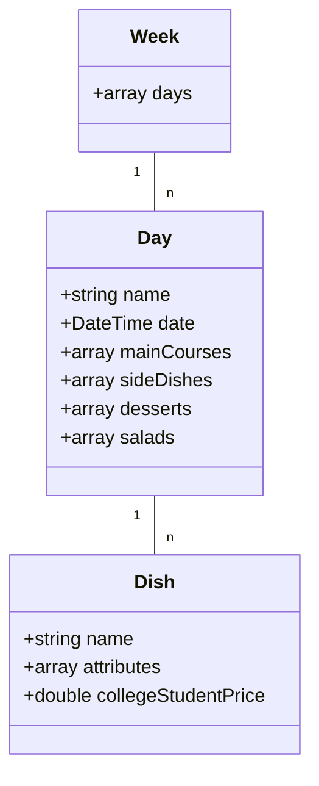

# HofUniversityCanteenData


## Introduction
**HofUniversityCanteenData** is a small functional libary for accessing and filtering the canteen plan of Hof University.<br>
It is written in PHP 7.3 and above. HofUniversityCanteenData is not supported nor endorsed by Studentenwerk Oberfranken or Hochschule Hof.
<br>
<br>

## Data structure

<br>

## Functions
Just copy the "HofUniversityCanteenData"-folder in your project and import the the used functions:
```
include "HofUniversityCanteenData/Helper.php";
use function HofUniversityCanteenData\convertAllUnconvertedDataToWeek;
use function HofUniversityCanteenData\convertWeekToFormatedGermanString;
use function HofUniversityCanteenData\downloadAllUnconvertedData;
use function HofUniversityCanteenData\filterWeekByAttributeIdsAndDayNumber;
```
<br>

You can use the following self-explanatory functions:<br>
- `getAttributeIdsTable():array`<br>
- `downloadAllUnconvertedData(dayNumber:int, monthNumber:int):SimpleXMLElement`<br>
- `convertAllUnconvertedDataToWeek(allUnconvertedData:SimpleXMLElement):Week`<br>
- `filterWeekByAttributeIdsAndDayNumber(week:Week, attributeIds:array, dayNumber:int):Week`<br>
- `convertWeekToFormatedGermanString(week:Week):string`<br><br>

## Testing
The library was tested manually. I could not find any bugs, but there still may be some.
<br><br>

## Example
You can find a realistic example [here](https://github.com/stevensolleder/HofUniversityCanteenData/blob/main/Example.php).<br><br>
## Get in contact
Feel free to get in contact and share your experience with **HofUniversityCanteenData**. Bug reports are also very appreciated.
